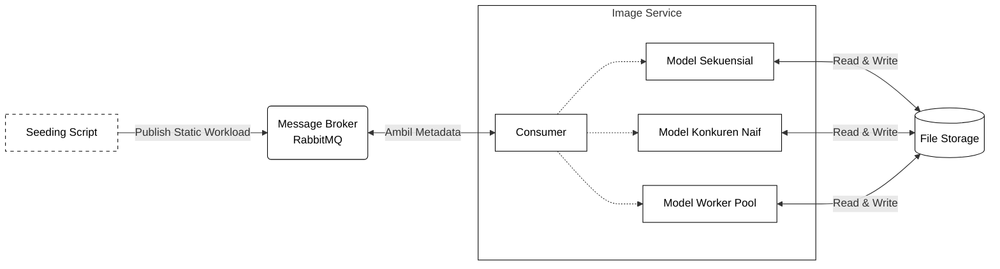

# Eksperimen Perbandingan Model Konkuren Go

Prototipe eksperimen evaluasi performa model pemrosesan gambar pada sistem portal berita

## Arsitektur Sistem



## Skenario yang Diuji

| Model | Deskripsi |
|-------|-----------|
| Sequential | Proses gambar satu per satu secara berurutan |
| Naive_Concurrent | Setiap gambar diproses dalam goroutine terpisah tanpa batasan |
| WorkerPool_4 | Goroutine dibatasi sejumlah 4 worker menggunakan pola worker pool |

## Dataset

Dataset diunduh dari **IMAGINE** (Image Analysis, Measurement, and Monitoring - Intelligent Eye)  
Sumber: https://kisi.pcz.pl/imagine/

**Spesifikasi:**
- Jumlah: 100 gambar JPEG
- Kamera: Nikon D5 (38), Nikon D810 (31), Nikon Z7 (31)
- Resolusi: bervariasi

**Cara download dataset:**
```bash
./download_dataset.sh
```

Script akan mengunduh 100 gambar ke folder `storage/uploads/`

## Cara Menjalankan

### 1. Eksperimen Performa dan Kinerja Sistem (Go & Docker)
```bash
# download dataset terlebih dahulu
./download_dataset.sh

# jalankan eksperimen otomatis ( Sequential, Naive Concurrent, Worker Pool )
./run_experiment.sh
```

### 2. Pengujian Kualitas Citra (MSE & PSNR)
```bash
# hitung nilai MSE dan PSNR untuk gambar asli (uploads) vs gambar kompresi (compressed)
python calculate_mse_psnr.py
```

## Hasil Eksperimen

Seluruh hasil pengujian dan log mentah disimpan secara otomatis di dalam direktori `results/`:

1. **Pengujian Kinerja Sistem (`run_experiment.sh`)**
   - File Data: `results/experiment_data.csv` (Timestamp, Scenario, Total_Images, Duration_Sec, CPU_Avg_Percent, Peak_RAM_MB, Num_Workers)
   - Log Detail: `results/logs/{Scenario}_{Total_Images}_run{Iteration}.log`

2. **Pengujian Kualitas Citra (`calculate_mse_psnr.py`)**
   - File Data: `results/image_quality_mse_psnr.csv` (No, Nama_Gambar, Format_Asli, Format_Hasil, Quality, Ukuran_Asli_KB, Ukuran_WebP_KB, Reduksi_Rasio_Percent, MSE, PSNR_dB)
   - Log Detail: `results/logs/image_quality_mse_psnr.log`

## Publikasi Terkait

Penelitian ini telah dipublikasikan pada prosiding internasional:

- **Judul:** *Sustainable Image Processing for Digital News Platforms: Evaluating Go Concurrency Models for Efficient Media Workloads*
- **Publikasi:** E3S Web of Conferences, Volume 706 (2026) 03008
- **DOI:** [10.1051/e3sconf/202670603008](https://doi.org/10.1051/e3sconf/202670603008)
- **URL Artikel:** [E3S Web of Conferences](https://www.e3s-conferences.org/articles/e3sconf/abs/2026/24/e3sconf_interconnects2026_03008/e3sconf_interconnects2026_03008.html)

## Teknologi

- Go 1.24
- libvips 8.15
- RabbitMQ 3.13
- Docker & Docker Compose
- Alpine Linux 3.19
- Python 3 (OpenCV & NumPy)
